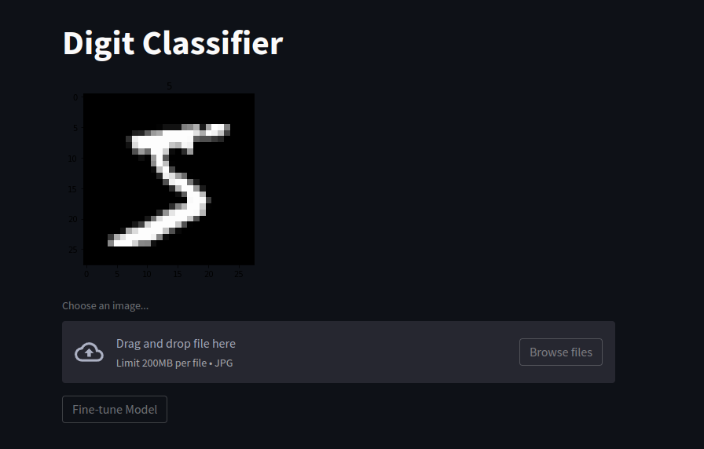
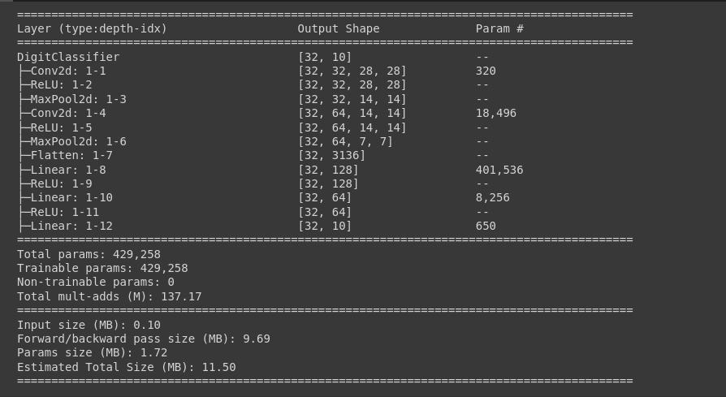

# Digit-Classifier-Streamlit

# Introduction

It is a web application where one user can test their images to predict whether
the image is a dog or a cat! The model has the power to predict image of Cats
and Dogs only, so you are requested to give image of a Cat Or a Dog, unless
useless prediction can be done!!!

# Usage

- Install the requirements
  ```sh
  pip install -r requirements.txt
  ```
- Download the training data. Follow instructions in [Readme](./input/Readme.md)
- Train the model.
  ```sh
  python3 src/model.py
  ```
- run the app
  ```sh
  streamlit run src/app.py
  ```
- Enjoy!!
  

- Note: Before uploading new image make sure user label input field is empty
# Behind The Scene
Simple CNN based model, which gives approx 99% accuracy

User Feedback is taken to store incorrect predictions and can be used to fine tune the model

Checkout model architecture in [model.py](./src/model.py)
 
 

